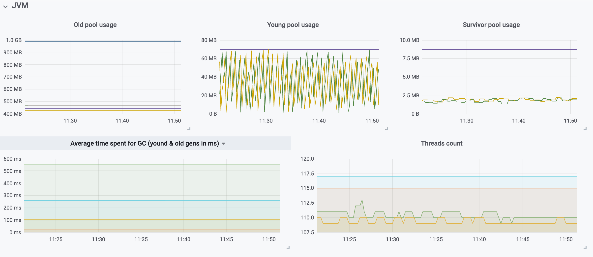

## Grafana dashboard for Logstash monitoring using Prometheus

This Grafana dashboard allows you to monitor various aspects of your logstash instances by using Prometheus.
Below is the full list of the monitored components:

* System
	* Average CPU Load
	* Logstash process total virtual memory usage
	* Logstash process file descriptors
* JVM
	* Average time spent for GC (young & old generations)
	* Threads count
	* Heap used percentage
	* Head used in MB
	* GC old generation events
	* GC young generation events
* Pipeline
	* Events processing times
	* Processed input/output events per second
	* Output events count
	* Input plugins events average waiting times
	* Beats input plugins connections
	* Input events per second over the last hour
	* Output events per second over the last hour
* Filters average duration


### Setup instructions

The dashboard has been tested on Grafana v6.4. Older versions (>2.5) will probably work out of the box or may require minor modifications eg. the `$__range` variable (available since v5.6) is used in some PromQL queries.

The setup is based on this [Prometheus exporter](https://github.com/alxrem/prometheus-logstash-exporter) for logstash written by [alxrem](https://github.com/alxrem). You can either run it locally on your logstash instance or deploy it on a docker container via [Docker Hub](https://hub.docker.com/r/alxrem/prometheus-logstash-exporter/).

In this use case it is assumed that:

* A docker container with the Prometheus exporter is deployed for each logstash instance we want to monitor.
* Logstash API has been configured to be accessible from the container running the exporter.
* One Prometheus job named `logstash` with multiple targets which are actually the containers running the exporters.
* A Prometheus type datasource configured on Grafana named `Prometheus`.

Because, as mentioned above, the exporters are running in a container the Prometheus `instance` label is overwritten in order to reflect the actual logstash fqdn instead of the `hostname:port` of the target which in this case is the docker host. Additionally, a custom label named `instance_pqdn` has been added to expose only the pqdn part of the hostname where needed in Grafana visualizations. Below is an example of the Prometheus configuration for job and targets:

```
  - job_name: 'logstash'
    scrape_interval:     10s
    static_configs:
      - targets: ['dockerhost.example.com:9304']
        labels:
          instance: 'logstash01.example.com'
          instance_pqdn: 'logstash01'
      - targets: ['dockerhost.example.com:9305']
        labels:
          instance: 'logstash02.example.com'
          instance_pqdn: 'logstash02'
```

### Miscellaneous
The dashboard relies on repeated panels, rows and templated variables. You can filter the graphs by selecting `instance`, `plugin_id`, `input_plugin` and `output_plugin` from the top menu bar.


* instance: Logstash fqdn.
* plugin_id: The unique id of the each plugin which used inside Logstash filters.
* input_plugin: The unique id of the each plugin which is used as Logstash input.
* output_plugin: The unique id of the each plugin which used as Logstash output.

Plugin selection can also be grouped by using Grafana tags. The grouping functionality is based on the `name` label which is returned by the Prometheus exporter for each plugin. In the example below, the `plugin_id: messages_date_1` will be grouped under `tag: date` in the menu bar.

```
logstash_pipeline_plugins_filters_events_duration_in_millis{id="messages_date_1",name="date",pipeline="main"} 354
```


The drop down menus allow also multiple selection, so for example if you have multiple logstash instances you can select `All` and the panels will adapt accordingly to display graphs from all hosts. Below is an example of System stats from two logstash instances. Average CPU load is distinct (repeated) for each instance while metrics for total vmem usage and open file descriptors are visualized for both instances in `Logstash ps total vmem` and `Logstash ps fds` respectively.


The same logic applies also for plugins where you can select specific plugin id(s) as well as instance(s) to visualize, for example the average duration of filters. This section is displayed under rows that are repeated based on the selected instance fqdn.


Other sample graphs from the JVM monitoring:





